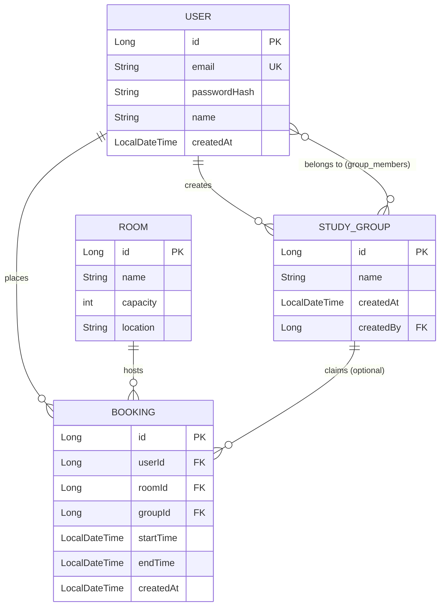

# StudySync

A study group & room booking platform backend, built with Spring Boot.

## Why I Built This

StudySync was built to solve a common coordination problem in student and workspace environments: scheduling rooms and managing study groups without scheduling conflicts. While simple booking applications work sequentially, they often fail under high concurrency—allowing multiple users to book the same room at the same time. StudySync is engineered with a robust, two-layered conflict detection system (programmatic pessimistic locking at the application level and a PostgreSQL exclusion constraint at the database level) to guarantee booking integrity even when hundreds of requests arrive simultaneously.

## Live Links

* **Interactive API Docs (Swagger UI):** [https://studysync-backend-a947.onrender.com/swagger-ui.html](https://studysync-backend-a947.onrender.com/swagger-ui.html) *(Note: Render free tier takes ~50 seconds to wake up from cold start)*
* **System Health Monitor (Actuator):** [https://studysync-backend-a947.onrender.com/actuator/health](https://studysync-backend-a947.onrender.com/actuator/health)

## Architecture Diagram

Below is the entity-relationship diagram representing StudySync's core domain models and their database mappings:



## Status

**Done:**

- JWT authentication (register/login), with timing-attack-resistant login
- Room CRUD
- Room booking with two-layer conflict detection (application + database),
  optionally on behalf of a study group, featuring concurrent deadlock retries
- Study groups: create, list, add/remove members
- PostgreSQL persistence via Flyway migrations with performance indexing
- Spring Boot Actuator for health checks and metrics monitoring
- API docs (OpenAPI/Swagger UI)
- Full request pipeline integration tests (`@SpringBootTest` + `MockMvc` + `Testcontainers`), including high-concurrency deadlock/double-booking race condition verification
- Multi-stage application Dockerization and multi-container Docker Compose orchestration
- Production deployment on Render with managed PostgreSQL databases and live Swagger endpoints

## Tech stack

- Java 21, Spring Boot 4.1.0, Maven
- PostgreSQL 16 (Docker), Flyway migrations, Spring Data JPA (`ddl-auto: validate`)
- Spring Security 7, JWT (`jjwt`), BCrypt, Bucket4j + Caffeine rate limiting
- Spring Boot Actuator (Metrics & Health)
- springdoc-openapi (Swagger UI)

## Running locally

### Option 1: Standard (JVM app + Docker DB)

1. Start only the Postgres service:
   ```bash
   docker compose up -d postgres
   ```
2. Run the application:
   ```bash
   mvn spring-boot:run
   ```

### Option 2: Full Docker Orchestration

You can build the application and run both the app and database inside Docker:

```bash
docker compose up --build
```

The application container automatically waits for the Postgres database to pass its readiness health check before starting.

Postgres must be up and accepting connections before the app runs—the app fails fast on startup if it can't reach the database.

Default local DB credentials (`studysync`/`studysync`/`studysync`) are set in `docker-compose.yml` and `application.yml` — fine for local dev only.

`jwt.secret` defaults to a dev-only value in `application.yml`; override it via the `JWT_SECRET` environment variable for anything beyond local dev.

## Running Tests

### Running Unit and Integration Tests

To run the complete test suite (unit and integration tests), ensure your Docker daemon is running and execute:

```bash
mvn verify
```

*(Note: `mvn test` will also run the test suite. Testcontainers automatically starts a temporary PostgreSQL database for the integration tests and cleans it up afterward.)*

## API

| Method | Path                            | Auth required                                       |
|--------|---------------------------------|-----------------------------------------------------|
| POST   | `/auth/register`                | No                                                  |
| POST   | `/auth/login`                   | No                                                  |
| GET    | `/rooms`                        | Yes                                                 |
| GET    | `/rooms/{id}`                   | Yes                                                 |
| POST   | `/rooms`                        | Yes                                                 |
| PUT    | `/rooms/{id}`                   | Yes                                                 |
| DELETE | `/rooms/{id}`                   | Yes                                                 |
| POST   | `/bookings`                     | Yes                                                 |
| GET    | `/bookings/me`                  | Yes                                                 |
| GET    | `/rooms/{id}/bookings`          | Yes                                                 |
| DELETE | `/bookings/{id}`                | Yes (owner only, 403 otherwise)                     |
| POST   | `/groups`                       | Yes                                                 |
| GET    | `/groups/me`                    | Yes                                                 |
| POST   | `/groups/{id}/members`          | Yes (group members only)                            |
| DELETE | `/groups/{id}/members/{userId}` | Yes (see *Study group membership invariants* below) |

`POST /bookings` takes an optional `groupId` to book a room on behalf of a
study group; the requester must already be a member of that group.

Authenticated requests need `Authorization: Bearer <token>` from
`/auth/login` or `/auth/register`. `/auth/login` and `/auth/register` are
rate-limited to 10 requests/minute per IP. Interactive API docs are at
`/swagger-ui.html` (unauthenticated).

## Design notes

- **Flyway autoconfiguration moved in Spring Boot 4.1**: it's no longer part
  of `spring-boot-autoconfigure`. Depending on `flyway-core` alone silently
  skips migrations on boot; the fix is depending on
  `spring-boot-starter-flyway` instead.


- **Hibernate stays read-only on schema**: `ddl-auto: validate` — Flyway owns
  all schema changes via versioned migrations in `db/migration`.


- **Booking conflicts are enforced at two layers, not one**: `BookingService`
  checks for overlapping bookings before inserting, but that check-then-insert
  pattern has a genuine TOCTOU race — two concurrent requests can both pass
  the check before either commits. A Postgres exclusion constraint
  (`btree_gist` + `EXCLUDE USING gist` on `room_id` and
  `tsrange(start_time, end_time)`, added in `V3.1`) is what actually prevents
  the double-booking; the application check just returns a fast, friendly 409
  for the common case. A constraint violation surfaces as
  `DataIntegrityViolationException`, which `BookingService` catches and
  rethrows as `BookingConflictException` so callers see one consistent 409
  either way. Verified by firing 10 concurrent conflicting `POST /bookings`
  requests at the same slot: exactly one succeeds, the rest get 409, and the
  Postgres logs show the exclusion constraint — not the application check —
  rejecting the losers.


- **Programmatic Transaction Retries & Room Locking**: To support high concurrency and mitigate database deadlock cycles (`40P01` SQLState) caused by overlapping slot insert contentions, booking creations bypass declarative `@Transactional` scopes. Instead, they run programmatically inside a `TransactionTemplate` retry loop (5 attempts with exponential backoff). The transaction begins by acquiring a pessimistic write lock on the target room (`findByIdForUpdate`), serializing competing bookings for the same room. Overlap validation checks are optimized using a fast database `EXISTS` query (`existsOverlapping`) rather than loading booking entities into JVM memory.


- **Time comes from an injected `Clock`, not `LocalDateTime.now()`**:
  `BookingService` and `GroupService` take a `java.time.Clock` via
  constructor injection (`ClockConfig` provides `Clock.systemDefaultZone()`
  in production) instead of calling `LocalDateTime.now()` directly, so tests
  can pin time with `Clock.fixed(...)` instead of depending on wall-clock
  time.


- **Invalid booking time ranges get a proper 400, not a raw exception**:
  `BookingService` used to throw a plain `IllegalArgumentException` for a
  non-future start time or a start that isn't before the end time, which had
  no exception mapping and fell through to a generic 500. It's now a
  dedicated `InvalidBookingRequestException` mapped to 400.


- **Request DTOs are bounded to what the backing storage can actually take**:
  BCrypt silently truncates any password past 72 bytes, so an unbounded
  password field was accepted at registration/login but only partially
  checked — passwords are now capped at 72 characters. Name and room fields
  are similarly capped at 255 characters to match their DB column widths,
  so an oversized value fails validation with a 400 instead of a DB error.


- **Login doesn't leak whether an email is registered**: a missing user used
  to short-circuit before the password check, so response timing revealed
  which emails exist. `AuthService` now always runs a BCrypt comparison,
  against a precomputed dummy hash when no user is found.


- **Rate-limit buckets are bounded, not just windowed**: the per-client
  bucket map in `RateLimitFilter` used to be an unbounded
  `ConcurrentHashMap` keyed by remote address — a slow memory-exhaustion
  vector. It's now a Caffeine cache that evicts idle entries and caps total
  size.


- **Optimized Security Context Caching**: Authenticated API controllers (`BookingController`, `GroupController`) extract the domain `User` entity directly from Spring Security's `UserPrincipal` context (which implements `UserDetails` and holds the `User` model) rather than making redundant repository queries (`findByEmail`) on every request.


- **Optimized JWT Processing**: Token verification and email claim extraction in `JwtUtil` are combined into `validateAndExtractEmail(token)`. This ensures that JWT claims are parsed and verified once per request inside `JwtAuthFilter` instead of twice.


- **Every exception maps to a sanitized response**: `GlobalExceptionHandler`
  has a logging catch-all plus explicit mappings for the common Spring MVC
  exceptions (malformed body, type mismatch, unsupported method, unknown
  route), so nothing falls through to a default response that leaks a stack
  trace. `AccessDeniedException` is deliberately re-thrown rather than
  handled here, so Spring Security's own filter still produces the 403.


- **Study group membership invariants**: creating a group makes the creator
  its first member; adding/removing members requires the requester to
  already be a member; only the creator can remove someone other than
  themselves; the creator can't leave while other members remain; and the
  last remaining member can never be removed — so a group can't end up with
  zero members (there's no group-deletion endpoint, so a group persists
  once created). Group reads-for-mutation use a pessimistic write lock to
  avoid concurrent membership races.
